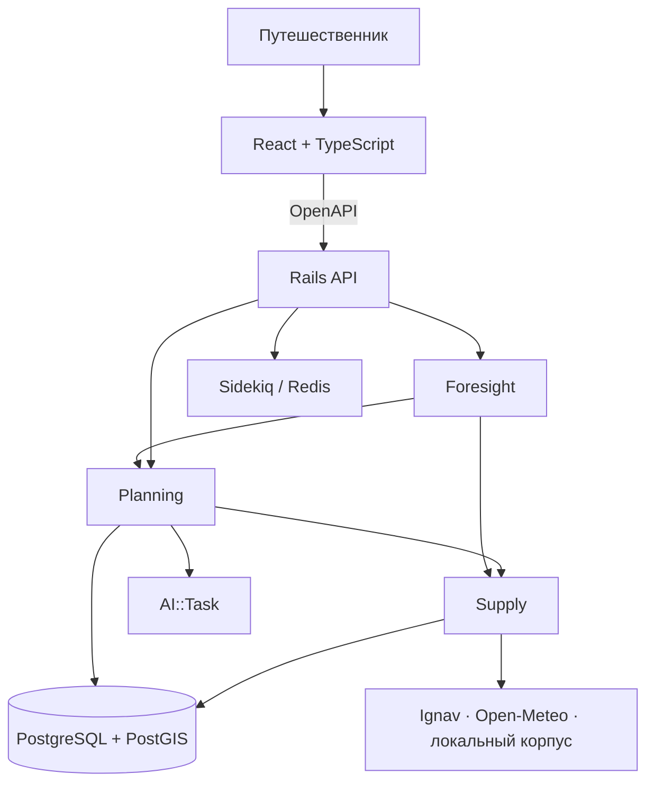

# Архитектура

## Форма системы

Elsewhere — модульный монолит на Rails с отдельным React-интерфейсом:

| Компонент | Назначение |
|---|---|
| `elsewhere-api` | Rails 8.1, Packwerk-пакеты, HTTP API и фоновые задачи |
| `elsewhere-web` | React + TypeScript, работает против OpenAPI-контракта |
| PostgreSQL + PostGIS | транзакционные и географические данные |
| Redis + Sidekiq | выполнение медленных операций |

Микросервисов, брокера сообщений и векторного хранилища нет: ни одно действующее требование их не оправдывает.
Общая база полезна, потому что версия Future, её цена, Match и Delta должны сохраняться согласованно.



Границы пакетов и владение данными описаны в [bounded_contexts.md](bounded_contexts.md), внешние источники —
в [data.md](data.md).

## Пути запросов

Чтение уже рассчитанных данных выполняется синхронно. Генерация Futures и симуляция возвращают `202 Job`, потому
что могут обращаться к поставщику и модели. Клиент опрашивает `GET /jobs/{id}`.

```text
POST /planning-sessions
  → разбор Мечты → Travel DNA → уточнения

POST /planning-sessions/{id}/futures
  → локальный фильтр жёстких ограничений
  → предварительный отбор направлений и объектов
  → поздний запрос тарифов (не более 24 на генерацию)
  → модельная цена проживания
  → Match и архетипы A/B/C
  → сохранение неизменяемых Future

POST /futures/{id}/simulations
  → инструкция преобразуется в закрытый Adjustment
  → рабочая копия DNA изменяется
  → решение пересчитывается
  → создаются новая Future и точная Delta
  → Forecast пересчитывается для новой версии
```

География, каталог, климатические нормы и калибровки цены подготавливаются заранее. В пользовательском запросе
из внешних поставщиков нужен только тариф; прогноз погоды запрашивается по необходимости.

## Архитектурные инварианты

1. LLM читает и пишет язык, но не рассчитывает числа.
2. Любой внешний HTTP-вызов находится в Supply.
3. Match имеет contributions, Risk — evidence, PriceComponent — происхождение.
4. Неопределённость представлена данными (`unscored_dimensions`, `coverage`, `freshness`, `claim_kind`).
5. Future неизменяема и версионируется.
6. Любое изменение Future проходит через Planning::Simulator.
7. Медленная работа представлена ресурсом Job.
8. Модельная цена проживания всегда маркируется `modeled`.
9. Новая инфраструктура появляется только вместе с доказанным требованием и решением в журнале.

## Поведение при отказе

- Supply превращает ошибку поставщика в явный недоступный результат; внутренности HTTP наружу не протекают.
- AI::Task проверяет JSON Schema и использует детерминированный fallback с признаком деградации.
- Planning возвращает меньше Futures или `NoSolution`, но не нарушает ограничения и не дополняет набор фикцией.
- Foresight показывает неполное покрытие с причиной и не строит риск без доказательства.

## Контракты

- Публичная форма: [openapi.yaml](../04_api/openapi.yaml).
- Внутренние фасады: [provider_adapters.md](../04_api/provider_adapters.md).
- Решения и численные пороги: [decision_log.md](../00_project/decision_log.md).
