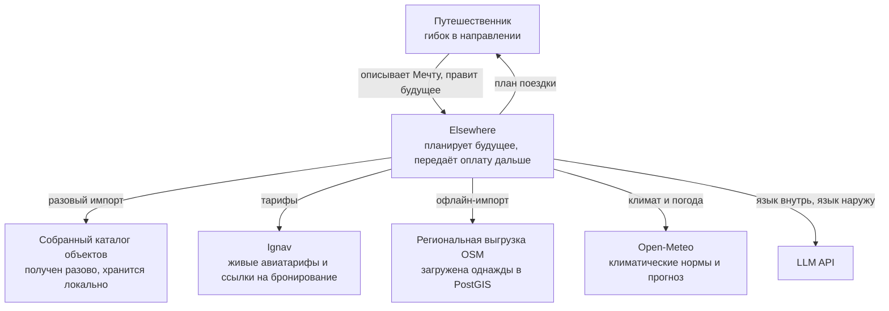
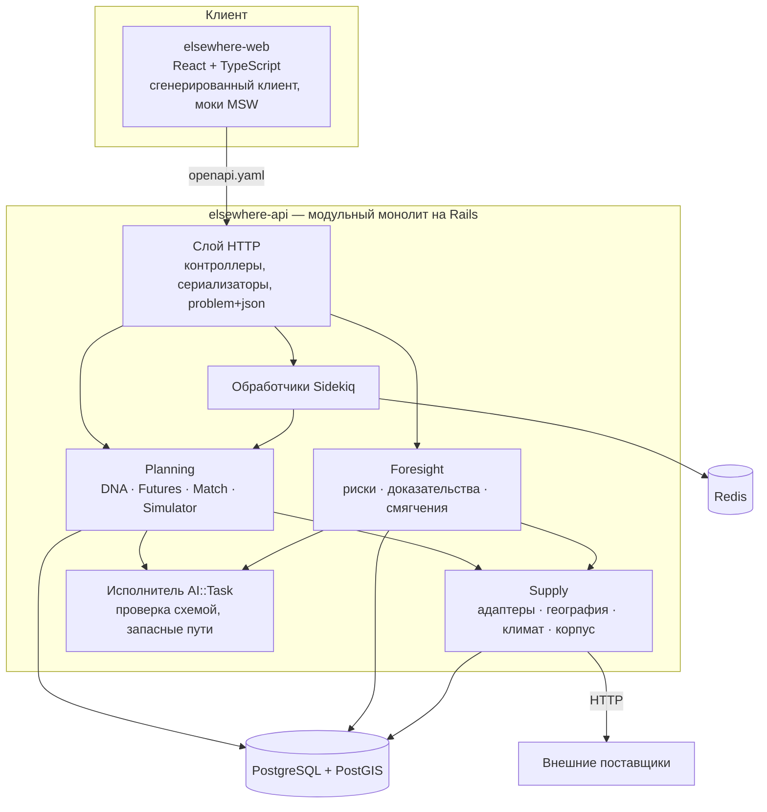

# C4 — контекст и контейнеры

---

## Уровень 1 — контекст системы

Две вещи стоит прочитать дважды. **Через Elsewhere ничего не бронируется и не оплачивается** (DEC-018) — путь
заканчивается планом поездки. И **живых стрелок во время запроса только две** (Ignav и Open-Meteo); каталог и
географические данные локальны, так что ни один поставщик не может сорвать демонстрацию.

## Уровень 2 — контейнеры

### Ответственность контейнеров

| Контейнер | Владеет | Зависит от | Как отказывает |
|---|---|---|---|
| `elsewhere-web` | весь интерфейс, сгенерированный клиент, моки | только от `openapi.yaml` | Честно показывает устаревшее состояние; никогда не выдумывает цены |
| Слой HTTP | проверка запросов, сериализация, problem+json | все контексты | Возвращает типизированные проблемы, не протекает внутренностями |
| Planning | DNA, Futures, Совпадение, Симулятор, дельты | Supply, AI | Возвращает меньше Futures с примечанием, а не добивает |
| Foresight | пункты риска, доказательства, покрытие, смягчения | Supply, AI, чтение Future | Сообщает `assessed: false` с причиной |
| Supply | весь внешний ввод-вывод, география, климат, корпус, фикстуры | поставщики | Возвращает значения `Unavailable`; ошибки поставщика наружу не уходят |
| AI::Task | промпты, проверка схемой, повторы, запасные пути, учёт стоимости | LLM API | Уходит на детерминированный путь; ответ никогда не блокирует |
| Sidekiq | генерация Future, симуляция, сбор каталога и импорт географии | Planning, Supply | Повторяет с отступом; статус задачи — полноценный ресурс API |

## Почему границы именно такие

Каждая отвечает на свой вопрос, и это настоящая проверка границы:

- **Supply** — «что говорит внешний мир?» Единственное место, которое может быть медленным, ненадёжным,
  неавторизованным или отсутствующим, и единственное, которое знает, что число смоделировано, а не наблюдалось.
- **Planning** — «что предложить и почему?» Детерминированно и сравнимо между версиями, иначе симулятор бессмыслен.
- **Foresight** — «что может пойти не так у *этого* человека?» Обязан деградировать так, чтобы никто не заметил.
- **AI::Task** — «где входит язык?» Ограждение делает возможными оценку качества, контроль стоимости и запасной путь.

## Развёртывание в MVP

Одно приложение Rails, один Postgres, один Redis, одна статическая сборка фронтенда.
`SUPPLY_MODE=live|fixture` выбирает реализацию адаптера (DEC-005). Каталог и географические данные локальны,
поэтому демонстрация никогда не зависит от доступности поставщика.
